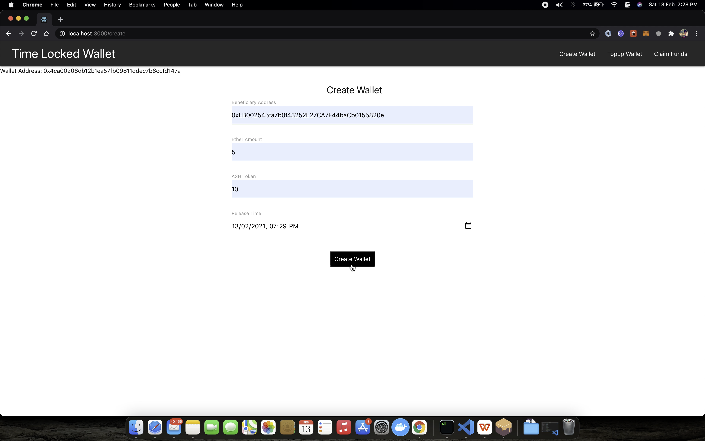

# Time Locked Ethereum Wallet

### Overview 

An end-to-end Ethereum based time locked wallet for depositing and claiming Ether and/or a custom ERC20 token after a certain release time is reached. Can be used for vesting for an ICO, pension or trust funds.

1. Clone Factory Pattern is used to optimise the gas consumption on wallet creation using delegate calls.
2. Below is the comparision of the gas cost for **General Factory Pattern** and **Clone Factory Pattern** -
  - Gas consumed for wallet creation with **General Factory Pattern** - 685437
  - Gas consumed for wallet creation with **Clone Factory Pattern** - 197876
  - % decrease in gas cost with **Clone Factory Pattern** ~ 70%
3. Refer below article to know how delegate calls are used in EVM to optimise the contract creation.
https://medium.com/coinmonks/delegatecall-calling-another-contract-function-in-solidity-b579f804178c

### Features 
1. Create a new wallet for beneficiary.
2. Deposit Ether and/or ASH Token (ERC20 token) to the beneficiary wallet with a certain relase time.
3. Claim Ether and/or ASH Token from the wallet only after the release time.
4. Topup existing beneficiary wallet with Ether and ASH token.

### Running the DApp locally 

##### Prerequisite

1. Truffle
2. Ganache GUI application
2. Metamask plugin

##### Steps 
1. Run the Ganache application. Create a new workspace with the following configuration -
    > Truffle Projects  : ```./truffle.config```. Enter the absolute path here. 
    > Host: 127.0.0.1    
    > port: 8545,            
    > network_id: 2020 
    > Gas price: 20000000000 wei (approx)
2. Compile and deploy the required smart contracts. 
    ```sh
    truffle migrate --reset
    ```
3. Start the react client application located at ```./client```. Need to install node modules for the first time.
    ```sh
    npm run start
    ```
4. The react application will run at ```http://localhost:3000/```
5. Connect to new custom RPC in the Metamask plugin with the configurations same as that used for ganache.(one time setup).

### Demo




